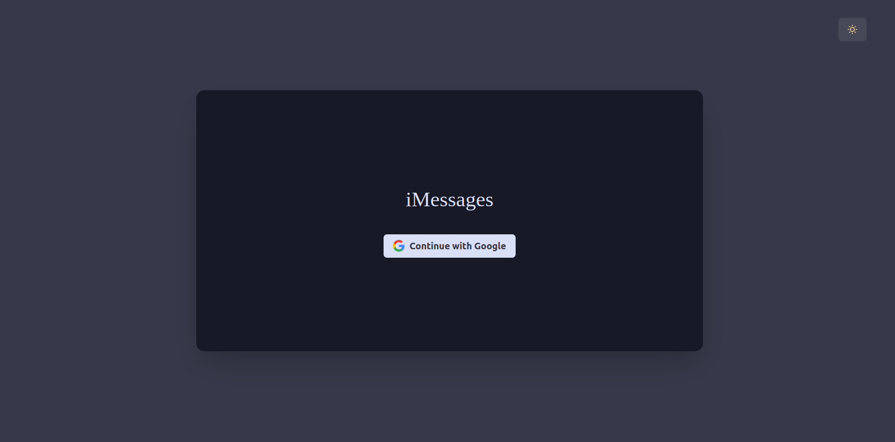
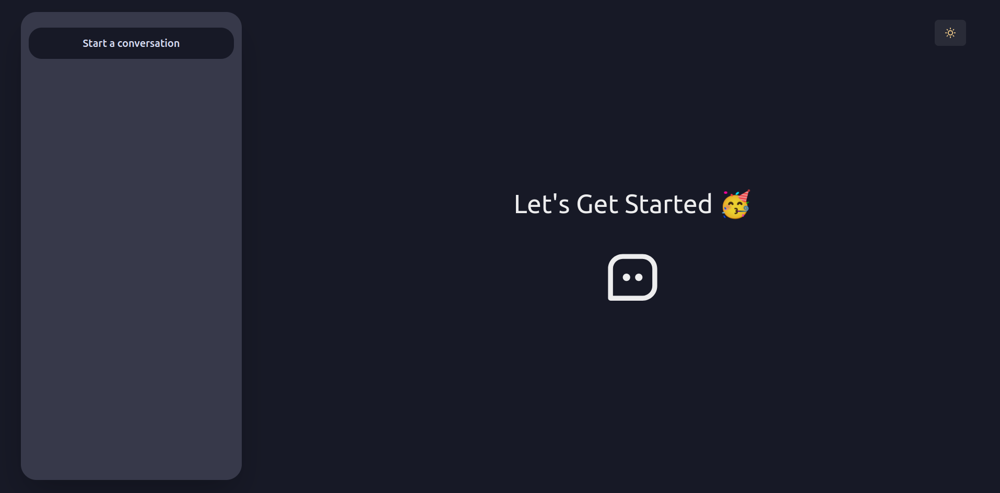
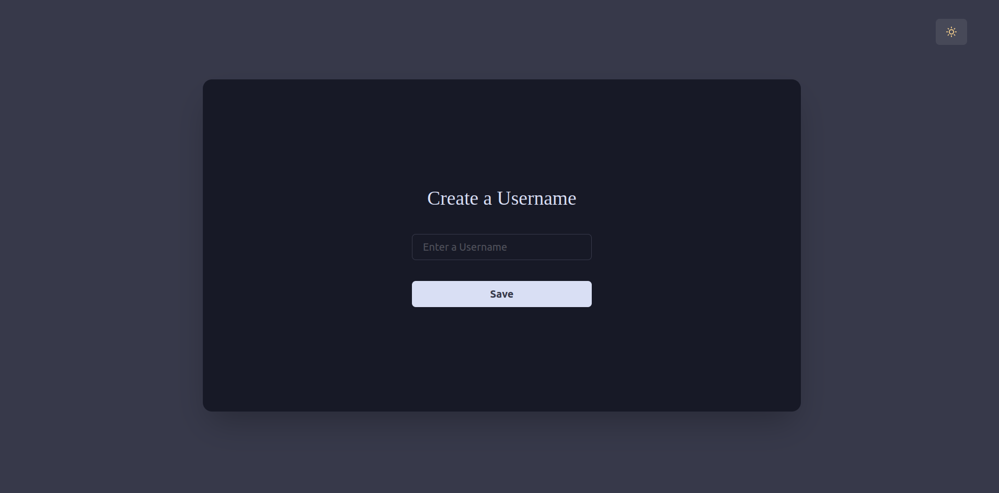
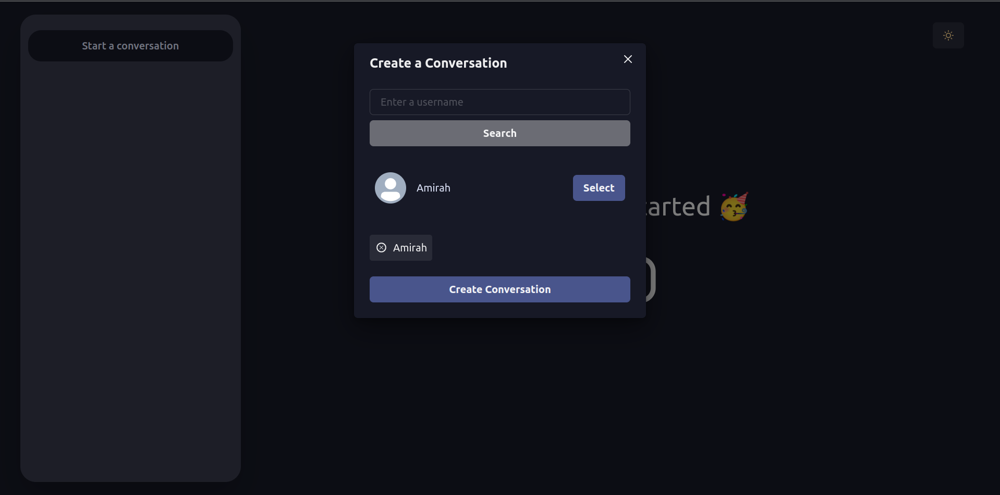
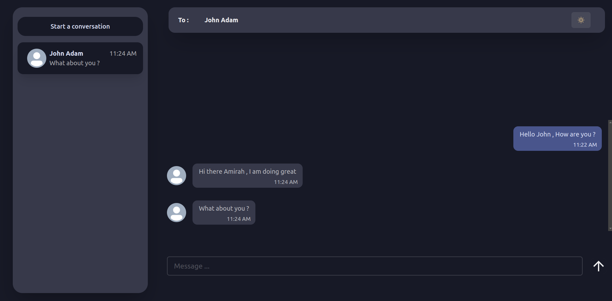

# Next JS / Chat-App

[](https://skills.thijs.gg)


## Live Demo
https://next-js-chat-app-ruddy.vercel.app/

## Installation

```
* git clone https://github.com/AdamAmirah/NextJS--ChatApp.git

* Make sure you got docker && docker-compose installed

* Provide ALL the enviroment variables in the .env file

*** RUN THE FOLLOWING ***

  docker-compose build

  docker-compose up

```


## Screenshots







